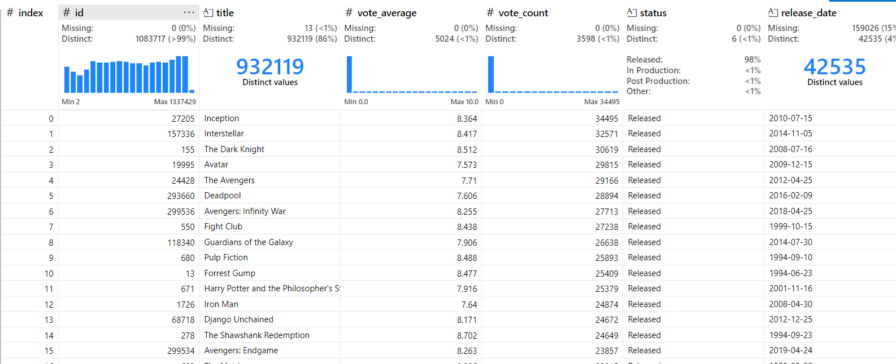
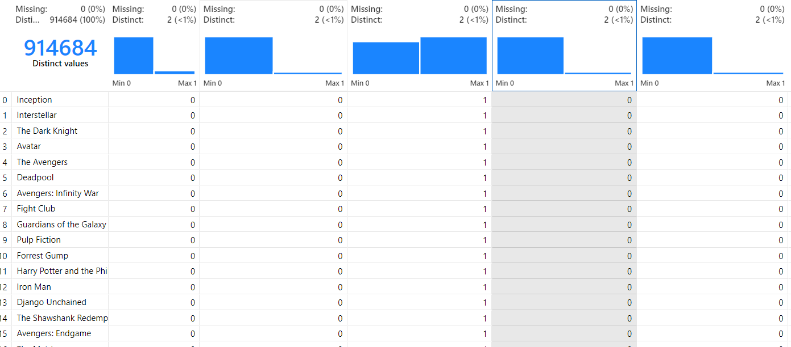
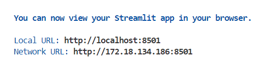
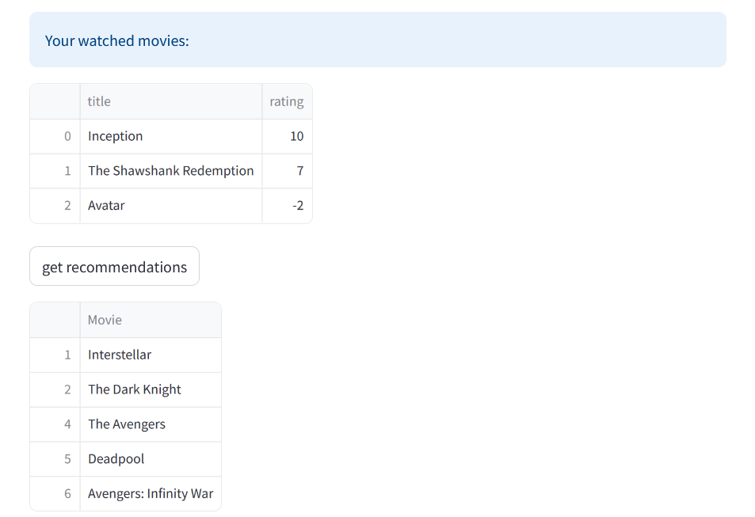

# Movie Recommendation Web App

## Data Cleaning and Preprocessing
In this section, we focused on cleaning the dataset by removing duplicates, handling missing values, and ensuring data consistency. We then preprocessed the data by converting all columns (except the title column) to numerical values.

> **Dataset before cleaning:**


> **Dataset after preprocessing:**


## How to Use

To run the web app, execute the following command in your terminal from the root directory of the project:

```bash
streamlit run src/recommendation-system/recommendation-web-app.py
```

If the web page doesn't open automatically, you'll see a message in your terminal with a similar output. Simply copy the provided Local URL and paste it into your favorite browser (of course it is  Firefox 😄).



### Steps to Get Recommendations:

1. **Input Movie**: In the first cell, start typing the name of a movie you've watched. Then, either select a suggested movie in the second cell or continue typing the movie name.
2. **Add a rating to this movie** : In the second cell , give a rate from -10 to 10 ( -10 : you hated it so much , 10 : you loved it so much)
3. **Add Movie and Rating**: Click the `Add movie and rating` button. Repeat this step for every movie you've watched to enhance the accuracy of your recommendations.
4. **Get Recommendation**: Once you've added all your movies, click the `Get recommendation` button to receive your personalized movie suggestions.



### Additional Features

- **Remove a Movie**: If you've added a movie twice or made a mistake with the rating, you can remove it using the `Delete movie` button by specifying its index.